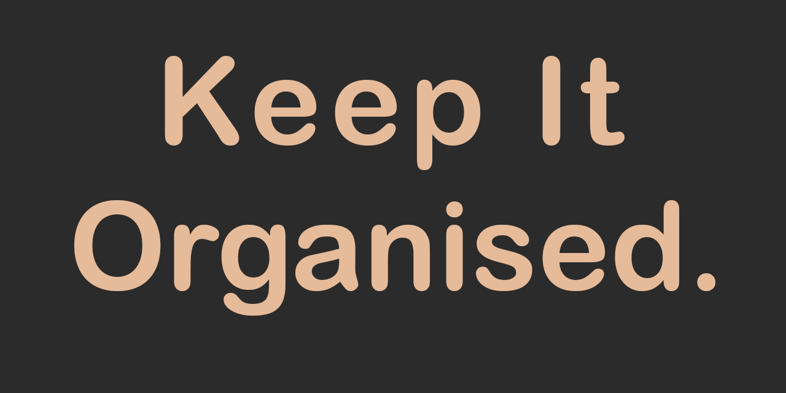

# General
Organised is an organisation system geared towards whoever feels the
need to get organised whether in their university or professional life.
It covers such aspects as mark calculation, productive time tracking, event scheduling
and task organisation.

It aims to be the friend who helps you with
productivity and organisation to get the most out of your time.

A brief introduction of Organised can be found [here](output/KeepItOrganisedBrief.pdf).

# Installation
### Installer
- An [installer](output/KeepItOrganisedSetup.exe) is provided for Windows systems. Download it, install it and 
  use Organised on your Windows machine;

- I also recommend reading the [Notes segment](#notes) of the [Technical Brief section](#technical-brief).

### Source code
- All source code and resources needed are available here on Github. Feel free to tinker Organised to your own
liking or suggest improvements;

- Keep in mind that you will need to add your own SQLite JDBC to connect with the database of Organised;

- Also, depending on your IDE you might have problems with references to the images & database. Database 
  reference can be modified in [Database.java](src/database/Database.java) and the majority of image links
  can be modified in the relevant [FXML Files](src/views) and class [ControlScene.java](src/controllers/utilities/ControlScene.java);

- The main start point of the system is [Main.java](src/Main.java);
  
- A [jar file](output/Organised.jar) is provided as well. Keep in mind that an SQLite JDBC jar file will need to be in the same
  directory as the jar file for desktop app to open.
  
# User Guide
Organised  consists of 4 main sections: Marks, Time, Schedule and Tasks. Whilst navigating through the
system, keep in mind that you might need to complete one section before moving to the other. For example, add
years and modules in Marks and then move to study period addition in Time.

### First Launch

Using Organised for the first time you will have to register. The username and the password you use to create an
account will act as your login details to access Organised. To avoid logging in each time you launch Organised, make
sure you check the "Keep me logged in." checkbox.

### Profile
Your statistics. Populate Organised with information and see your profile update based on your progress.
The banner at the top changes based on the time of day.
  
### Marks
Add your Years, Modules & Assignments. When you complete your assignments, add your marks to Organised and get 
grade calculations for each module and each year. Note that:
- Values in Marks are rounded up, so minimal variation is possible;
- Grades in Marks are weighted according to given module credits and year percentages, where applicable;
- Degree classifications are indicative
- All Year modules are split evenly between Autumn and Spring semesters.
  
### Time
Add your Periods (such as Year 1 Semester 1, Year 2 Spring Vacation, etc.) and track how much time you
work during the day. Get statistics about each day and week and compare them amongst themselves or other periods.

Each Period is associated with a Year. A Year can be added in the Marks tab.

### Schedule
Add Events to your periods and get your schedule Organised. Such events as lectures, which repeat over 
multiple weeks, can be added as recurring events to save time.

To use this tab, you'll have to have Periods created. You can create a Period in Time tab.

Events have to be associated with a module. In case your event is neutral *(e.g. Trip to the beach)* add a module
for such occasions *(e.g. Free time)* in the Year, which is associated with the Period the Event is to be added to.
  
### Tasks
Add Tasks to your periods & weeks and always be Organised with your activities. Tasks which need to be 
repeated in multiple weeks can be added as recurring tasks-in the same manner as events. Observe your 
progress and know what needs to be done.

To use this tab, you'll have to have Periods created. You can create a Period in Time tab.

Tasks have to be associated with a module. In case your task is neutral *(e.g. Clean computer screen)* add a module for
such occasions *(e.g. Housework) in the Year, which is associated with the Period the Task is to be added to.

Tasks can be Completed, Not Completed or Dropped. A dropped task is a task which was meant to be completed, but has
been discarded for some reason. A dropped task does not impact the progress bar of tasks completion in any way.

# Technical Brief

### Notes
 - As of now, the main system window is fixed at 1400 x 900 pixels to preserve the necessary layout.
There is no way of changing that size (yet!);

 - Currently, your database file might be saved in your AppData/Local/Temp folder. Be aware, that updating your machine or deleting
temporary files might remove your data entirely. I recommend backing up the database file in case you accidently delete those files.

### Behind Organised
The back-end of Organised is Java whilst the front-end is made with JavaFX. SQLite is used as a local database, to avoid
server hosting and make Organised a self-contained, standalone application. The bundle for the installer was exported
from IntelliJ and packaged as an installer with Inno Setup script.

### Resources Used
The font used in Organised is Arial and Arial Rounded MT Bold. The icons used are available at 
[Materials](https://material.io/resources/icons/).

# Contact
If you wish to reach out to me regarding, any improvements, ideas, other projects, a chat or a cup of coffee
you can do so by [LinkedIn](https://www.linkedin.com/in/houssem-lachtar/).
